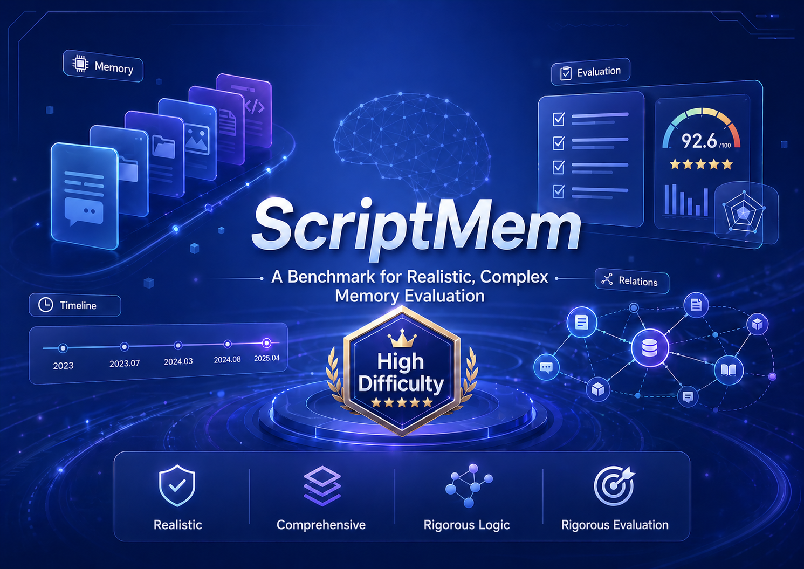
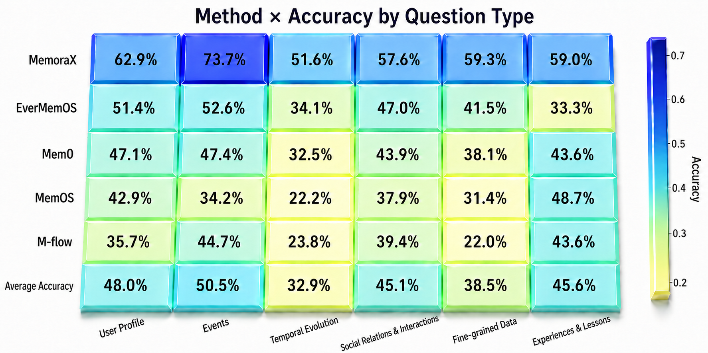

<div align="center">



# ScriptMem

**A diagnostic benchmark for long-term agent memory, built from script-derived memory tasks.**

[](https://creativecommons.org/licenses/by-nc/4.0/)
[](https://www.python.org/downloads/)

[Overview](#-overview) • [Why ScriptMem](#-why-scriptmem) • [Leaderboard](#-leaderboard) • [Quick Start](#-quick-start) • [Citation](#-citation)

</div>

---

## 📰 News

- **[2026.05]** 🎉 ScriptMem v1.0 released: 457 questions across 4 script-derived source works.

---

## 🎯 Overview

As large models evolve from single-turn QA tools into long-running agents, **memory** is becoming the bottleneck. A truly useful agent memory system has to do more than store user preferences — it has to track multi-turn dialogues, multi-party relationships, and continuously evolving information; decide what to remember, what has expired, what to update; and know when to admit *"I don't have enough evidence."*

**ScriptMem** is an agent memory benchmark grounded in real-world scripted narratives. Instead of relying only on synthetic long dialogues from LLMs, ScriptMem constructs **knowledge graphs over characters, events, and relations** and samples cross-character, cross-time, cross-event memory chains into **457 evaluation questions** across **6 question types**.

Please note ScriptMem releases task-specific questions, options, reference answers, metadata, and evaluation code; the original source texts are not included in this repository.

<div align="center">

<br/>
<em>From two-party dialogues to multi-party interactions: a leap in structural complexity, not just token count.</em>
</div>

---

## ✨ Why ScriptMem

ScriptMem is designed around three principles:

- **🎬 Real-world scripted narratives**: 4 source works spanning long-term relationships (*Friends*), high-density debate (*12 Angry Men*), deep dialogue games (*The Man from Earth*), and public-event conflict (*An Enemy of the People*).
- **🕸️ Graph-driven question construction**: hundreds of entity nodes and thousands of relation edges per script, enabling systematic sampling of complex memory chains rather than random sentence picking.
- **🔬 Diagnostic by design**: 6 question types correspond to 6 memory failure modes — distractors are derived from task-specific annotations and violate one key constraint, so wrong answers reveal *which* memory mechanism broke.🚧 An automated attribution module that traces each error to a specific memory stage is **coming soon**.

---

## 🏆 Leaderboard

Overall accuracy under unified GPT-4o-mini backbone.

| Rank | Method | Overall | Date |
|---:|:---|---:|:---|
| 🥇 | MemoraX | 60.3% | 2026.05 |
| 🥈 | EverMemOS | 42.9% | 2026.05 |
| 🥉 | Mem0 | 42.0% | 2026.05 |
| 4 | MemOS | 36.4% | 2026.05 |
| 5 | M-Flow | 32.6%  | 2026.05 |

📩 Want to submit your results? See [Submission](#-submission) below or open a PR.

### Per question-type breakdown

<div align="center">

</div>

The breakdown reveals structural blind spots: existing systems are not uniformly weak — each fails on different memory dimensions.

---


## 📦 Dataset Statistics

| Script | Total | Single Choice | Multi-Select | Ordering |
|:---|---:|---:|---:|---:|
| *12 Angry Men* | 99 | 71 | 20 | 8 |
| *An Enemy of the People* | 94 | 59 | 27 | 8 |
| *Friends* | 174 | 99 | 61 | 14 |
| *The Man from Earth* | 90 | 69 | 15 | 6 |
| **Total** | **457** | **298** | **123** | **36** |

**6 question types**: User Profile · Event Tracking · Temporal Evolution · Social Relations · Fine-Grained Data · Lessons Learned.


For copyright and attribution reasons, the released data does not include the original script conversation text. The `conversation` field keeps only an omission notice plus a short synthetic example that illustrates the expected dialogue schema. See [`data/README.md`](data/README.md) for date metadata and dialogue type notes; evaluation uses the question, options, and gold answers.

---

## 🚀 Quick Start

No third-party Python package is required.

```bash

# 1. Run evaluation on your submission
python scripts/run_eval.py \
  --data-dir data/raw \
  --submission your_submission.json \
  --output eval_summary.json \
  --details eval_details.json


# 2. Build per-question diagnostic report
python scripts/summarize.py \
  --input-path eval_details.json \
  --output-path eval_details_summary.json \
  --markdown-output-path eval_details_summary.md
```

---

## 📂 Repository Structure

```
ScriptMem/
├── data/
│   ├── raw/                # Question/answer data; original script text omitted
│   └── public/             # Exported JSONL for easy consumption
├── src/
│   ├── export.py           # Raw → public exporter
│   ├── evaluate.py         # Accuracy evaluator
│   ├── score_mcq.py        # Deterministic MCQ scorer
│   └── summarize.py        # Build diagnostic reports
├── scripts/                # CLI wrappers
└── assets/                 # Figures and visualizations
```

---

## 📝 Submission

The official submission file is a JSON list with four dictionaries, one per script:

```json
[
  {
    "dataset": "angry",
    "qa_results": [
      { "qa_id": "angry:conv-0#q0000", "predicted_answer": "(B)" }
    ]
  }
]
```

Predicted answer format:
- Single-choice: `(B)`
- Multi-select: `(A, C, D)` — must include all and only correct options
- Ordering: `(D, A, C, B)` — must match exact correct order

See [`data/public/submission_template.json`](data/public/submission_template.json) for a starter template.

---

## 📄 Citation

If you use ScriptMem in your research, please cite:

```bibtex
@misc{scriptmem2026,
  title={ScriptMem: A Diagnostic Benchmark for Long-Term Agent Memory},
  year={2026},
  author={{ScriptMem Team}},
  url={https://github.com/memorax-ai/ScriptMem}
}
```

---

## 🤝 Contributing

We welcome contributions:
- 🐛 Found a bug or annotation error? Open an [issue](../../issues).
- 🏆 Want to add your method to the leaderboard? Submit a PR with your `submission.json` and a brief method description.
- 📚 Have a source text we should consider for a future benchmark extension? Open a discussion.

---

## 📜 License & Attribution

The benchmark materials including task design, questions, reference answers, annotations, evaluation metadata, evaluation protocol, documentation, and project-created figures, are released for non-commercial academic and research use under [CC BY-NC 4.0](LICENSE.txt), unless otherwise stated.

This repository does not include, host, or distribute any third-party scripts, transcripts, subtitles, dialogue, or original conversation text. The `conversation` field contains only an omission notice and a short synthetic schema example.

The CC BY-NC 4.0 license applies only to the original materials created for ScriptMem. It does not apply to any third-party copyrighted materials that may be required to reproduce or extend the benchmark. Such materials remain the property of their respective rightsholders.

No endorsement by any original creator, publisher, studio, platform, institution, or rightsholder is implied. If a rightsholder believes any material should not be included, please contact the repository maintainers for review and removal.

If you use ScriptMem in a paper, technical report, leaderboard submission, model card, evaluation note, or related research artifact, please cite ScriptMem.

---

<div align="center">

**Built by MemoraX AI and University of Oxford.**

⭐ Star this repo if ScriptMem helps your research!
